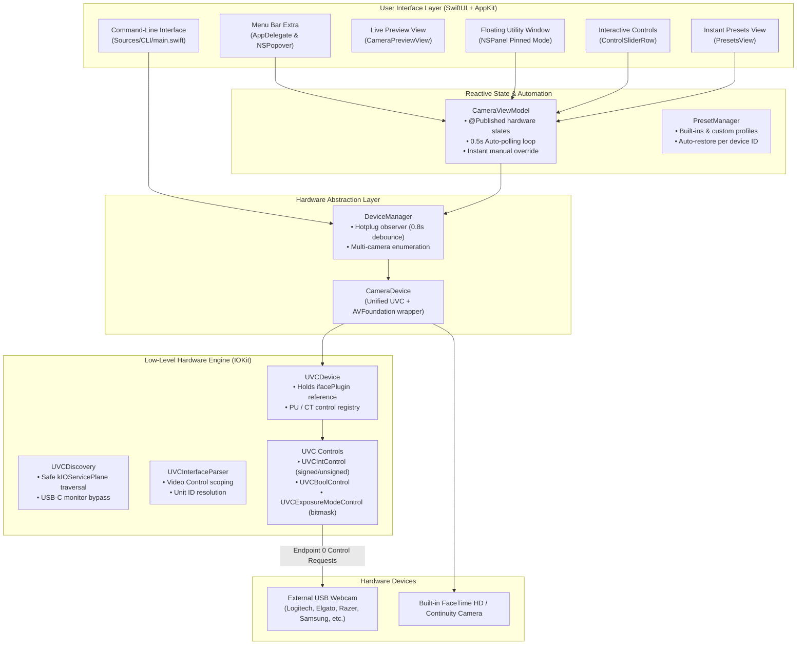

# CamDial: Architecture & Developer Continuity Guide

This document explains the internal architecture, hardware protocol implementation, and critical design decisions of the **CamDial** codebase. It is designed to allow any developer or AI assistant in a new session to resume work immediately without re-investigating low-level macOS or UVC quirks.

---

## 1. System Architecture



---

## 2. Low-Level UVC Engine Details

### A. Non-Disruptive Device Discovery (USB-C Monitor Protection)
- **Challenge**: Opening an `IOUSBDeviceUserClient` on high-bandwidth USB-C monitors or multi-function hubs triggers link re-negotiation, causing external screens to disconnect or blink.
- **Solution** (`Sources/UVC/UVCDiscovery.swift`): Before invoking `IOCreatePlugInInterfaceForService`, the discovery engine queries the device's registry properties. If `bDeviceClass != 14` (Video), it iterates through child services in `kIOServicePlane` looking specifically for child interfaces with `bInterfaceClass == 14`. Non-video devices (monitors, keyboards, storage) are skipped completely without creating user clients.

### B. COM Plugin Interface Lifetime Management
- **Challenge**: In IOKit USB, `IOUSBInterfaceInterface190` is a COM interface created by an `IOCFPlugInInterface` factory. If the plugin pointer is released (`defer { Release(plugin) }`), the underlying plugin bundle memory is deallocated, leaving the interface pointer dangling and causing a `SIGSEGV` (code -11) on subsequent requests.
- **Solution** (`Sources/UVC/UVCDevice.swift`): Ownership of the `ifacePlugin` pointer is passed to `UVCDevice`. It is kept alive for the duration of the camera connection and cleanly released in `UVCDevice.deinit`:
  ```swift
  deinit {
      _ = interface.pointee.pointee.Release(interface)
      if let plugin = plugin {
          _ = plugin.pointee.pointee.Release(plugin)
      }
  }
  ```

### C. Video Control vs. Video Streaming Descriptor Scoping
- **Challenge**: Both Video Control (VC) and Video Streaming (VS) interfaces use class-specific descriptor type `0x24`. In Video Streaming, descriptor subtype `0x05` defines uncompressed video frames (`VS_FRAME_UNCOMPRESSED`), which collides with the Processing Unit subtype (`0x05`) in Video Control. Scanning without interface scoping overwrote Processing Unit IDs with frame indices, breaking picture controls.
- **Solution** (`Sources/UVC/UVCInterface.swift`): A state flag `inVideoControl` tracks whether the parser is currently inside an interface descriptor matching `bInterfaceClass == 0x0E && bInterfaceSubClass == 0x01`. Class-specific Unit IDs are only extracted when `inVideoControl == true`.

### D. Signed vs. Unsigned 16-Bit Registers
- **Challenge**: In UVC 1.1 / 1.5, `PU_BRIGHTNESS_CONTROL` and `PU_HUE_CONTROL` are signed 16-bit integers (`INT16`). Many cameras return negative minimums (e.g. -64 represented as `0xFFC0`). Treating this as an unsigned integer returns `65472`, causing range checks (`min >= max`) to fail and erroneously marking the control incapable.
- **Solution** (`Sources/UVC/UVCControl.swift`): `UVCIntControl` supports signed conversion. If `minVal > 32767` on a 2-byte control, or if explicitly declared signed, values are converted via `Int16(bitPattern: UInt16(...))` and written via two's complement.

### E. Auto Exposure Mode Bitmask
- **Challenge**: `CT_AE_MODE_CONTROL` is not a 0/1 boolean. It is a bitmask defined in UVC:
  - `1`: Manual Mode (manual shutter & iris)
  - `2`: Auto Mode (automatic shutter & iris)
  - `4`: Shutter Priority Mode
  - `8`: Aperture Priority Mode (most webcams use this for standard auto exposure)
- **Solution** (`Sources/UVC/UVCControl.swift`): `UVCExposureModeControl` implements bitmap querying. Setting `isAuto = true` selects `.aperturePriority` (or `.auto` fallback), while `isAuto = false` selects `.manual` (`0x01`).

### F. Dynamic Preset Range Mapping
- Different webcams have vastly different register ranges (e.g. brightness 0..255 vs -64..+64 vs 0..100).
- `UVCDevice.mapValue(_:to:)` normalizes preset values across the camera's actual hardware `[minimum...maximum]` range to ensure presets look consistent across different hardware manufacturers.

---

## 3. UI & Reactive Architecture

### A. Live Auto-Tracking Sliders
- When hardware Auto mode is active, the camera's internal Image Signal Processor (ISP) continuously updates its live registers (color temperature Kelvin, exposure time, sensor gain, focal distance).
- `CameraViewModel` runs a `0.5s` polling timer (`pollAutoValues()`).
- The slider knob and readout dynamically follow the camera's live adjustments; the readout turns the accent color next to a filled `Auto` switch.
- Sliders remain interactive: as soon as the user drags a slider, Auto mode automatically disengages (`autoBinding?.wrappedValue = false`) to grant immediate manual control.

### B. Content-Fitted, Top-Anchored Window Geometry
- **Challenge**: In macOS AppKit, when a popover or utility window increases in height near the bottom of the screen, the window manager pushes the window frame **upwards**. Previously, opening the live preview increased height from 420px to 630px, pushing the top header off the top of the screen. A fixed-size window avoids that, but leaves large empty areas on short tabs and squeezes the preview into a thin strip.
- **Solution**:
  - The window is `400pt` wide and its height follows the content (`NSHostingController.sizingOptions = .preferredContentSize` in `AppDelegate.swift`), so each tab gets exactly the room it needs and the preview is shown at the camera's real aspect ratio.
  - Resizes keep the top edge fixed: the popover hangs from the menu bar, and the pinned panel grows downward. If the pinned panel would extend past the bottom of the screen, `windowDidResize` lifts it just enough to stay visible, never above the top of the screen.
  - Tab content (`SettingsTabContainer.swift`) is measured and only scrolls past `settingsContentMaxHeight`, which `ContentView` derives from the screen's visible height minus the chrome and preview, so the whole window always fits on screen.

### C. 1-Click Instant Presets
- Presets are applied immediately on click without an "Apply Preset" button.
- Built-in presets:
  1. `Side Light / Window Compensation`: Lifts shadows and balances contrast for single-direction window light.
  2. `Natural Daylight`: 5500K neutral daylight look.
  3. `Warm Studio`: 3400K cozy amber studio look.
  4. `Night / Low Light`: High exposure & sensor sensitivity.
  5. `Vibrant & Crisp`: High saturation and contrast.
  6. `Black & White`: Complete monochrome (`saturation = 0`).
  7. `Factory Default`: Resets all registers to camera defaults.

---

## 4. Directory Structure

```
.
├── .github/
│   └── workflows/
│       ├── ci.yml            # Automated CI build on macOS runner
│       └── release.yml       # Release asset packaging on tag push
├── .gitignore                # Git exclusions (build, caches, OS metadata)
├── ARCHITECTURE.md           # This document (technical reference)
├── CONTRIBUTING.md           # Pull request and coding guidelines
├── Info.plist                # App bundle metadata and permissions
├── LICENSE                   # MIT License
├── Makefile                  # Build automation (cli, app, dist, clean, help)
├── PLAN.md                   # Original project plan
├── README.md                 # User guide and CLI manual
└── Sources/
    ├── Common/
    │   ├── Models.swift      # Common data models
    │   └── Presets.swift     # Preset profiles & persistence (UserDefaults)
    ├── UVC/
    │   ├── UVCConstants.swift # UVC 1.1 / 1.5 selectors, units, request codes
    │   ├── UVCControl.swift   # Low-level IOKit request engine & control types
    │   ├── UVCInterface.swift # Configuration descriptor parsing
    │   ├── UVCDevice.swift    # High-level camera model & register setters
    │   └── UVCDiscovery.swift # Safe USB device enumeration
    ├── DeviceManager/
    │   ├── CameraDevice.swift # Unified UVC / AVFoundation abstraction
    │   └── DeviceManager.swift# Camera registry & hotplug debounce
    ├── App/
    │   ├── AppDelegate.swift  # Menu bar extra, NSPopover & floating NSPanel
    │   ├── main.swift         # GUI entry point
    │   └── Views/
    │       ├── CameraViewModel.swift   # Reactive bridge & auto-polling loop
    │       ├── CameraPreviewView.swift # AVCaptureVideoPreviewLayer wrapper
    │       ├── ContentView.swift       # Main window layout
    │       ├── ControlSliderRow.swift  # Single-line slider row with Auto switch
    │       ├── SettingsTabBar.swift    # Icon + label tab bar
    │       ├── SettingsTabContainer.swift # Content-fitted tab body, scrolls past max height
    │       ├── PictureSettingsView.swift
    │       ├── ExposureSettingsView.swift
    │       ├── OpticsSettingsView.swift
    │       └── PresetsView.swift       # 1-click instant preset cards
    └── CLI/
        └── main.swift        # Standalone 'camdial' command-line binary
```

---

## 5. How to Add a New Hardware Control

To add a new UVC hardware control (e.g. White Balance Component Blue/Red, Digital Pan/Tilt):
1. **Define Selectors** in `Sources/UVC/UVCConstants.swift` (match the official UVC specification).
2. **Add Control Property** in `Sources/UVC/UVCDevice.swift` as a `UVCIntControl` or `UVCBoolControl`.
3. **Expose in `CameraViewModel.swift`** with `@Published` property and setter method.
4. **Add UI Row** in the relevant SwiftUI view (`PictureSettingsView`, `ExposureSettingsView`, or `OpticsSettingsView`) using `ControlSliderRow`.
5. **Add CLI Option** in `Sources/CLI/main.swift` under the `get` and `set` command handlers.
