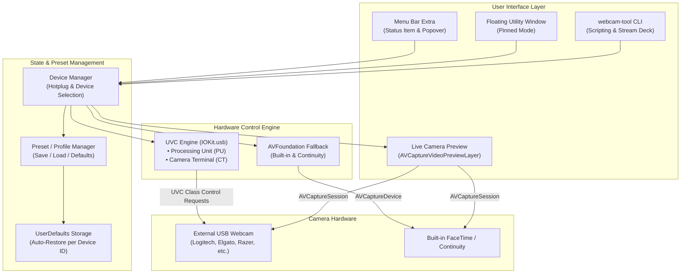

# Webcam Settings for macOS - Implementation Plan

A native macOS utility inspired by **Webcam Settings** (Mac App Store) that provides direct hardware-level control over external USB Video Class (UVC) webcams (Logitech, Razer, Elgato, Anker, OBSbot, Dell, generic UVC cameras) as well as built-in cameras. It features real-time slider controls for lighting/exposure, brightness, contrast, saturation, sharpness, white balance, focus, and zoom, complete with live video preview, profiles/presets, a menu-bar companion, and a CLI tool.

---

## Direct Hardware Control vs. Software Filters

This tool communicates directly with the physical camera hardware registers via USB Video Class (UVC) protocol over macOS IOKit, exactly like *Webcam Settings*.
- **System-wide persistence**: Settings persist on the camera hardware while active across **all** video apps (Zoom, Microsoft Teams, Google Meet, FaceTime, QuickTime, OBS Studio, Discord, etc.).
- **Dynamic capability query**: Available controls and ranges are queried dynamically from the connected camera hardware. If a camera does not support a specific hardware feature (e.g., optical zoom or motorized pan/tilt), that control is cleanly hidden or disabled.
- **Built-in & Continuity Support**: Built-in FaceTime HD cameras on Apple Silicon Macs route through Apple's proprietary ISP and do not support low-level UVC USB controls; for built-in and Continuity cameras, the tool provides AVFoundation-level controls (exposure target bias, white balance lock, and zoom).

---

## Architecture Overview



---

## Detailed Feature Set

### 1. Hardware Picture Controls (UVC Processing Unit)
- **Brightness**: Sensor black-level offset (`0x02`)
- **Contrast**: Gain curve contrast adjustment (`0x03`)
- **Saturation**: Color intensity adjustment (`0x07`)
- **Sharpness**: Edge enhancement filtering (`0x08`)
- **White Balance**:
  - Auto White Balance Temperature toggle (`0x0B`)
  - Manual Color Temperature slider in Kelvin (e.g., 2,800K – 6,500K) (`0x0A`)
- **Hue**: Color tint adjustment (`0x06`)
- **Gamma**: Midtone luminance curve adjustment (`0x09`)
- **Backlight Compensation**: Toggle/slider for high-contrast backlight environments (`0x01`)
- **Anti-Flicker / Power Line Frequency**: Off, 50 Hz (Europe/Asia), 60 Hz (Americas) (`0x05`)

### 2. Hardware Exposure & Optics (UVC Camera Terminal)
- **Exposure Mode**: Auto Exposure vs. Manual Exposure (`0x02`)
- **Exposure Time (Absolute)**: Manual shutter integration time slider (`0x04`)
- **Sensor Gain**: Analog/digital sensor sensitivity slider (`0x04` on PU)
- **Auto Focus**: Auto focus enable/disable toggle (`0x08`)
- **Manual Focus (Absolute)**: Precise focal distance slider (`0x06`)
- **Zoom (Absolute)**: Digital / optical zoom factor (`0x0B`)
- **Pan / Tilt**: Directional controls for cameras with motorized or digital PTZ (`0x0D`)

### 3. Live Video Preview
- Embedded real-time video preview using `AVCaptureSession`.
- Toggle button to collapse or expand the preview, minimizing resource usage when not needed.
- Instant visual feedback while dragging sliders.

### 4. Presets, Profiles & Auto-Restore
- **Hardware Reset**: Single button to restore any individual slider or all settings to factory default.
- **Factory Presets**: Built-in quick configurations ("Natural Daylight", "Warm Indoor", "Night / Low Light", "Studio Setup").
- **Custom Presets**: Create, save, rename, and delete custom named profiles.
- **Auto-Restore on Reconnect**: Remembers your preferred settings by camera hardware model/serial; when you unplug and reconnect your webcam, your custom settings are automatically reapplied!

### 5. Dual GUI + CLI Interface
- **macOS App (`WebcamSettings.app`)**: Native menu bar companion with modern SwiftUI styling.
- **CLI Binary (`webcam-tool`)**: Standalone binary for Terminal, automations, shell scripts, Raycast/Alfred shortcuts, and Elgato Stream Deck.

---

## Project Structure

```
/Users/willem/dev/webcam tool/
├── PLAN.md                                 # This implementation plan
├── Makefile                                # Compilation & packaging script
├── Info.plist                              # App metadata & NSCameraUsageDescription
├── Sources/
│   ├── Common/
│   │   ├── Models.swift                    # Data models, control specifications, ranges
│   │   └── Presets.swift                   # Profile storage and JSON serialization
│   ├── UVC/
│   │   ├── UVCConstants.swift              # USB & UVC standard constants (PU, CT, requests)
│   │   ├── UVCInterface.swift              # IOKit USB device finding & control request runner
│   │   ├── UVCControl.swift                # Base control (GET_CUR, SET_CUR, GET_MIN, GET_MAX, GET_DEF)
│   │   ├── UVCDevice.swift                 # High-level webcam representation with all properties
│   │   └── UVCDiscovery.swift              # Enumeration of connected USB video devices
│   ├── DeviceManager/
│   │   ├── CameraDevice.swift              # Unified device protocol (UVC + AVFoundation)
│   │   └── DeviceManager.swift             # Device monitoring, selection, hotplug events
│   ├── CLI/
│   │   └── main.swift                      # Command-line interface entry point
│   └── App/
│       ├── AppDelegate.swift               # Status item, menu bar popover, floating window
│       ├── Views/
│       │   ├── ContentView.swift           # Main control panel view
│       │   ├── CameraPreviewView.swift     # Live camera feed preview component
│       │   ├── ControlSliderRow.swift      # Modern slider with value readout & reset button
│       │   ├── PictureSettingsView.swift   # Brightness, Contrast, Saturation, Sharpness, WB
│       │   ├── ExposureSettingsView.swift  # Exposure, Gain, Anti-flicker
│       │   ├── OpticsSettingsView.swift    # Focus, Zoom, Pan/Tilt
│       │   └── PresetsView.swift           # Preset list and save/load UI
│       └── main.swift                      # App entry point
└── build/                                  # Output directory for WebcamSettings.app & webcam-tool
```

---

## Verification Plan

### Automated Verification
1. **Compilation Check**:
   - Run `make clean && make all` to verify that both the CLI binary and the macOS App bundle compile cleanly without warnings or errors.
2. **Bundle Integrity Verification**:
   - Check bundle structure: `test -d build/WebcamSettings.app/Contents/MacOS && test -f build/WebcamSettings.app/Contents/Info.plist`.
   - Verify executable flags: `file build/webcam-tool` and `file build/WebcamSettings.app/Contents/MacOS/WebcamSettings`.
3. **CLI Self-Test**:
   - Run `./build/webcam-tool --help` to verify arguments parsing and usage display.
   - Run `./build/webcam-tool list` to verify device enumeration.

### Manual Verification
1. **Camera Discovery**:
   - Launch `./build/webcam-tool list` and open `WebcamSettings.app`.
   - Verify that connected external webcams and built-in cameras appear in the selector.
2. **Live Adjustments**:
   - Open a video app (Zoom, Google Meet, FaceTime, or QuickTime Movie Recording) or toggle the built-in live preview.
   - Move the **Brightness**, **Contrast**, **Saturation**, and **White Balance** sliders.
   - Observe instantaneous video picture updates on screen.
3. **Toggle Controls**:
   - Toggle Auto White Balance off, adjust color temperature in Kelvin, then toggle Auto back on.
   - Toggle Auto Exposure off and adjust Exposure Time and Gain manually.
4. **Presets & Reset**:
   - Click "Reset to Defaults" and confirm settings restore to camera factory defaults.
   - Save a preset named "My Studio", modify sliders, then select "My Studio" from the preset menu and confirm all sliders return to saved values.
5. **Persistence**:
   - Unplug and reconnect the external webcam, or quit and relaunch the app, and verify that the last configured settings are restored.
